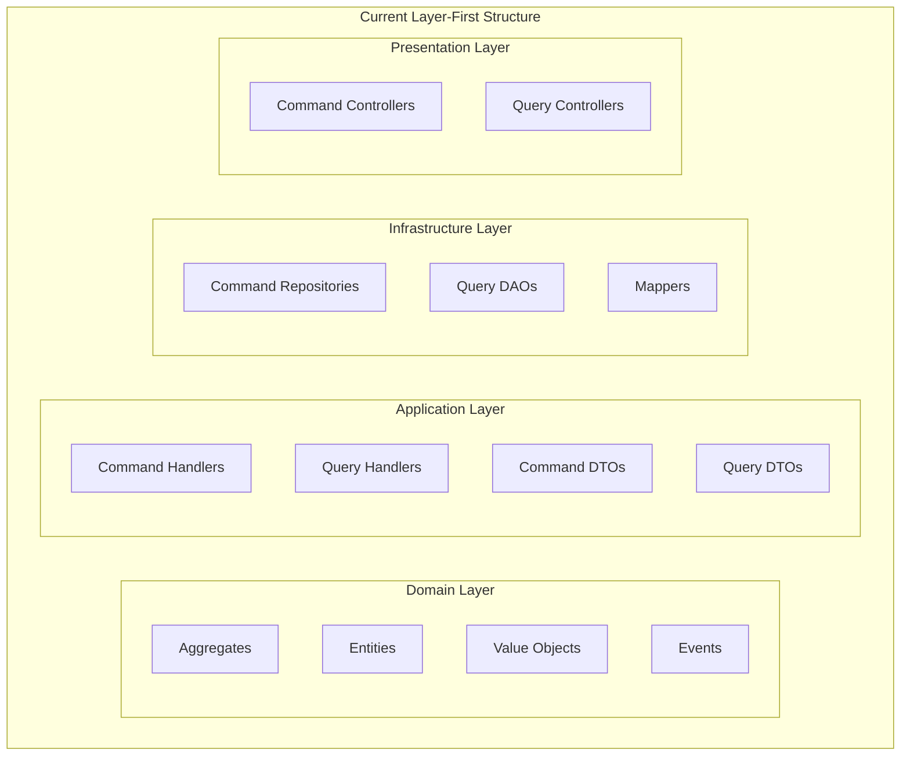
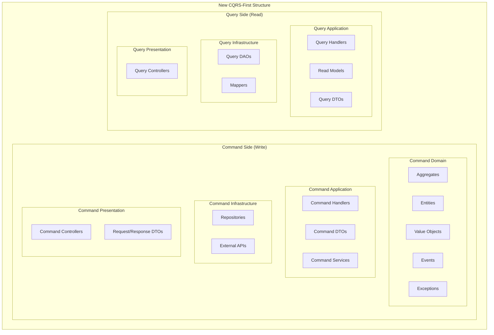

# Design Document

## Overview

현재 레이어별로 구성된 CQRS 디렉토리 구조를 Command/Query 중심의 구조로 리팩토링하는 설계입니다. 이 변경을 통해 CQRS 패턴의 의도를 명확히 하고, 쓰기와 읽기 작업을 최상위에서 분리하여 개발자 경험과 코드 탐색성을 크게 개선합니다.

## Architecture

### Current Structure (AS-IS)



### Target Structure (TO-BE)



## Components and Interfaces

### Directory Structure Mapping

#### Shop Context Structure Transformation

**Before (AS-IS):**
```
domains/shop/src/main/java/harry/boilerplate/shop/
├── domain/
│   ├── aggregate/
│   ├── entity/
│   ├── valueobject/
│   └── event/
├── application/
│   ├── command/
│   └── query/
├── infrastructure/
│   ├── command/
│   └── query/
└── presentation/
    ├── command/
    └── query/
```

**After (TO-BE):**
```
domains/shop/src/main/java/harry/boilerplate/shop/
├── command/                         # 쓰기 작업 전용
│   ├── domain/                      # 비즈니스 로직 집중
│   │   ├── aggregate/               # 애그리게이트 루트들
│   │   ├── entity/                  # 도메인 엔티티들
│   │   ├── valueObject/             # 값 객체들 (카멜케이스)
│   │   ├── event/                   # 도메인 이벤트들
│   │   └── exception/               # 도메인 예외들
│   ├── application/                 # Command Application Layer
│   │   ├── handler/                 # Command Handler
│   │   ├── service/                 # Command Service (선택적)
│   │   └── dto/                     # Command DTO
│   ├── infrastructure/              # Command Infrastructure Layer
│   │   ├── repository/              # Repository 구현체
│   │   └── external/                # 외부 API 클라이언트
│   └── presentation/                # Command Presentation Layer
│       ├── controller/              # Command Controller
│       └── dto/                     # Request/Response DTO
└── query/                           # 읽기 작업 전용 (도메인 로직 없음)
    ├── application/                 # Query Application Layer
    │   ├── handler/                 # Query Handler
    │   ├── readModel/               # Read Model (카멜케이스)
    │   └── dto/                     # Query DTO
    ├── infrastructure/              # Query Infrastructure Layer
    │   ├── dao/                     # DAO 구현체
    │   └── mapper/                  # Entity → ReadModel 변환
    └── presentation/                # Query Presentation Layer
        └── controller/              # Query Controller
```

### Component Responsibilities

#### Command Side Components

**Command Domain Layer:**
```java
// 애그리게이트 루트 - 비즈니스 규칙의 중심
// domains/shop/src/main/java/harry/boilerplate/shop/command/domain/aggregate/Menu.java
@Entity
@Table(name = "menu")
public class Menu extends AggregateRoot<Menu, MenuId> {
    private MenuId id;
    private ShopId shopId;
    private String name;
    private String description;
    private Money basePrice;
    private boolean isOpen;
    private List<OptionGroup> optionGroups;
    
    // 핵심 비즈니스 메서드들
    public void open() {
        validateOpenConditions();
        this.isOpen = true;
        addDomainEvent(new MenuOpenedEvent(this.getId().getValue(), 
                                          this.shopId.getValue(), 
                                          this.name));
    }
    
    public void addOptionGroup(OptionGroup optionGroup) {
        validateOptionGroupAddition(optionGroup);
        this.optionGroups.add(optionGroup);
    }
}

// 값 객체 - 불변성 보장
// domains/shop/src/main/java/harry/boilerplate/shop/command/domain/valueObject/MenuId.java
public class MenuId extends ValueObject {
    private final String value;
    
    public MenuId(String value) {
        validateNotEmpty(value);
        this.value = value;
    }
    
    public static MenuId generate() {
        return new MenuId(UUID.randomUUID().toString());
    }
    
    public String getValue() {
        return value;
    }
}

// 도메인 이벤트
// domains/shop/src/main/java/harry/boilerplate/shop/command/domain/event/MenuOpenedEvent.java
public class MenuOpenedEvent implements DomainEvent {
    private final UUID eventId = UUID.randomUUID();
    private final Instant occurredAt = Instant.now();
    private final String aggregateId;
    private final String aggregateType = "Menu";
    private final int version = 1;
    
    private final String shopId;
    private final String menuName;
    
    public MenuOpenedEvent(String menuId, String shopId, String menuName) {
        this.aggregateId = menuId;
        this.shopId = shopId;
        this.menuName = menuName;
    }
    
    // getters...
}
```

**Command Application Layer:**
```java
// Command Handler - 트랜잭션 경계
// domains/shop/src/main/java/harry/boilerplate/shop/command/application/handler/CreateMenuCommandHandler.java
@Component
@Transactional
public class CreateMenuCommandHandler {
    private final MenuRepository menuRepository;
    private final ShopRepository shopRepository;
    
    public String handle(CreateMenuCommand command) {
        Shop shop = shopRepository.find(new ShopId(command.getShopId()));
        if (shop == null) {
            throw new ShopNotFoundException(command.getShopId());
        }
        
        Menu menu = new Menu(
            MenuId.generate(),
            new ShopId(command.getShopId()),
            command.getName(),
            command.getDescription(),
            Money.of(command.getBasePrice())
        );
        
        menuRepository.save(menu);
        return menu.getId().getValue();
    }
}

// Command DTO
// domains/shop/src/main/java/harry/boilerplate/shop/command/application/dto/CreateMenuCommand.java
public class CreateMenuCommand {
    @NotBlank(message = "가게 ID는 필수입니다")
    private final String shopId;
    
    @NotBlank(message = "메뉴 이름은 필수입니다")
    @Size(max = 100, message = "메뉴 이름은 100자 이하여야 합니다")
    private final String name;
    
    private final String description;
    
    @NotNull(message = "기본 가격은 필수입니다")
    @DecimalMin(value = "0", message = "가격은 0 이상이어야 합니다")
    private final BigDecimal basePrice;
    
    public CreateMenuCommand(String shopId, String name, String description, BigDecimal basePrice) {
        this.shopId = shopId;
        this.name = name;
        this.description = description;
        this.basePrice = basePrice;
    }
    
    // getters...
}
```

**Command Infrastructure Layer:**
```java
// Repository 구현체
// domains/shop/src/main/java/harry/boilerplate/shop/command/infrastructure/repository/MenuRepositoryImpl.java
@Repository
@Transactional
public class MenuRepositoryImpl implements MenuRepository {
    @PersistenceContext
    private EntityManager entityManager;
    
    @Override
    public Menu find(MenuId menuId) {
        return entityManager.find(Menu.class, menuId.getValue());
    }
    
    @Override
    public void save(Menu menu) {
        if (entityManager.contains(menu)) {
            entityManager.merge(menu);
        } else {
            entityManager.persist(menu);
        }
    }
    
    @Override
    public void delete(Menu menu) {
        entityManager.remove(menu);
    }
}
```

**Command Presentation Layer:**
```java
// Command Controller
// domains/shop/src/main/java/harry/boilerplate/shop/command/presentation/controller/MenuCommandController.java
@RestController
@RequestMapping("/shops/{shopId}/menus")
@Validated
public class MenuCommandController {
    private final CreateMenuCommandHandler createMenuCommandHandler;
    private final OpenMenuCommandHandler openMenuCommandHandler;
    
    @PostMapping
    public ResponseEntity<CommandResultResponse> createMenu(
            @PathVariable String shopId,
            @Valid @RequestBody CreateMenuRequest request) {
        
        CreateMenuCommand command = new CreateMenuCommand(
            shopId, 
            request.getName(), 
            request.getDescription(), 
            request.getBasePrice()
        );
        
        String menuId = createMenuCommandHandler.handle(command);
        
        return ResponseEntity.status(HttpStatus.CREATED)
            .body(CommandResultResponse.success("메뉴가 생성되었습니다", menuId));
    }
    
    @PutMapping("/{menuId}/open")
    public ResponseEntity<CommandResultResponse> openMenu(
            @PathVariable String shopId,
            @PathVariable String menuId) {
        
        OpenMenuCommand command = new OpenMenuCommand(shopId, menuId);
        openMenuCommandHandler.handle(command);
        
        return ResponseEntity.ok(
            CommandResultResponse.success("메뉴가 공개되었습니다"));
    }
}
```

#### Query Side Components

**Query Application Layer:**
```java
// Query Handler - 읽기 전용
// domains/shop/src/main/java/harry/boilerplate/shop/query/application/handler/MenuBoardQueryHandler.java
@Component
@Transactional(readOnly = true)
public class MenuBoardQueryHandler {
    private final MenuQueryDao menuQueryDao;
    private final ShopQueryDao shopQueryDao;
    
    public MenuBoardResult handle(MenuBoardQuery query) {
        ShopInfoReadModel shopInfo = shopQueryDao.findShopInfo(query.getShopId());
        if (shopInfo == null) {
            throw new ShopNotFoundException(query.getShopId());
        }
        
        List<MenuSummaryReadModel> menus = menuQueryDao.findOpenMenusByShopId(query.getShopId());
        
        return new MenuBoardResult(
            shopInfo.getShopId(),
            shopInfo.getShopName(),
            shopInfo.isOpen(),
            shopInfo.getMinOrderAmount(),
            menus
        );
    }
}

// Read Model - UI 최적화된 불변 데이터
// domains/shop/src/main/java/harry/boilerplate/shop/query/application/readModel/MenuSummaryReadModel.java
public class MenuSummaryReadModel {
    private final String menuId;
    private final String name;
    private final BigDecimal basePrice;
    private final String description;
    private final boolean isOpen;
    private final int optionGroupCount;
    
    public MenuSummaryReadModel(String menuId, String name, BigDecimal basePrice, 
                               String description, boolean isOpen, int optionGroupCount) {
        this.menuId = menuId;
        this.name = name;
        this.basePrice = basePrice;
        this.description = description;
        this.isOpen = isOpen;
        this.optionGroupCount = optionGroupCount;
    }
    
    // getters only (불변)...
}

// Query DTO
// domains/shop/src/main/java/harry/boilerplate/shop/query/application/dto/MenuBoardQuery.java
public class MenuBoardQuery {
    @NotBlank(message = "가게 ID는 필수입니다")
    private final String shopId;
    
    public MenuBoardQuery(String shopId) {
        this.shopId = shopId;
    }
    
    public String getShopId() {
        return shopId;
    }
}
```

**Query Infrastructure Layer:**
```java
// Query DAO - 읽기 최적화
// domains/shop/src/main/java/harry/boilerplate/shop/query/infrastructure/dao/MenuQueryDaoImpl.java
@Repository
@Transactional(readOnly = true)
public class MenuQueryDaoImpl implements MenuQueryDao {
    @PersistenceContext
    private EntityManager entityManager;
    
    @Override
    public List<MenuSummaryReadModel> findOpenMenusByShopId(String shopId) {
        String jpql = """
            SELECT new harry.boilerplate.shop.query.application.readModel.MenuSummaryReadModel(
                m.id, m.name, m.basePrice, m.description, m.isOpen,
                (SELECT COUNT(og) FROM OptionGroup og WHERE og.menu.id = m.id)
            )
            FROM Menu m 
            WHERE m.shopId = :shopId AND m.isOpen = true
            ORDER BY m.name
            """;
            
        return entityManager.createQuery(jpql, MenuSummaryReadModel.class)
            .setParameter("shopId", shopId)
            .setHint(QueryHints.READ_ONLY, true)
            .setHint(QueryHints.CACHEABLE, true)
            .getResultList();
    }
    
    @Override
    public MenuDetailReadModel findMenuDetail(String menuId) {
        // 복잡한 조인 쿼리로 UI에 최적화된 데이터 조회
        String jpql = """
            SELECT m FROM Menu m 
            LEFT JOIN FETCH m.optionGroups og 
            LEFT JOIN FETCH og.options 
            WHERE m.id = :menuId
            """;
            
        Menu menu = entityManager.createQuery(jpql, Menu.class)
            .setParameter("menuId", menuId)
            .setHint(QueryHints.READ_ONLY, true)
            .getSingleResult();
            
        return MenuReadModelMapper.toDetailReadModel(menu);
    }
}

// Mapper - Entity를 ReadModel로 변환
// domains/shop/src/main/java/harry/boilerplate/shop/query/infrastructure/mapper/MenuReadModelMapper.java
@Component
public class MenuReadModelMapper {
    
    public static MenuDetailReadModel toDetailReadModel(Menu menu) {
        List<OptionGroupReadModel> optionGroups = menu.getOptionGroups().stream()
            .map(MenuReadModelMapper::toOptionGroupReadModel)
            .collect(Collectors.toList());
            
        return new MenuDetailReadModel(
            menu.getId().getValue(),
            menu.getName(),
            menu.getDescription(),
            menu.getBasePrice().getAmount(),
            optionGroups
        );
    }
    
    private static OptionGroupReadModel toOptionGroupReadModel(OptionGroup optionGroup) {
        List<OptionReadModel> options = optionGroup.getOptions().stream()
            .map(option -> new OptionReadModel(option.getName(), option.getPrice().getAmount()))
            .collect(Collectors.toList());
            
        return new OptionGroupReadModel(
            optionGroup.getId().getValue(),
            optionGroup.getName(),
            optionGroup.isRequired(),
            options
        );
    }
}
```

**Query Presentation Layer:**
```java
// Query Controller
// domains/shop/src/main/java/harry/boilerplate/shop/query/presentation/controller/MenuQueryController.java
@RestController
@RequestMapping("/shops/{shopId}")
@Validated
public class MenuQueryController {
    private final MenuBoardQueryHandler menuBoardQueryHandler;
    private final MenuDetailQueryHandler menuDetailQueryHandler;
    
    @GetMapping("/menus")
    public ResponseEntity<MenuBoardResult> getMenuBoard(@PathVariable String shopId) {
        MenuBoardQuery query = new MenuBoardQuery(shopId);
        MenuBoardResult result = menuBoardQueryHandler.handle(query);
        
        return ResponseEntity.ok(result);
    }
    
    @GetMapping("/menus/{menuId}")
    public ResponseEntity<MenuDetailReadModel> getMenuDetail(
            @PathVariable String shopId,
            @PathVariable String menuId) {
        
        MenuDetailQuery query = new MenuDetailQuery(shopId, menuId);
        MenuDetailReadModel result = menuDetailQueryHandler.handle(query);
        
        return ResponseEntity.ok(result);
    }
}
```

## Data Models

### Package Structure Changes

#### Import Statement Updates

**Before (AS-IS):**
```java
import harry.boilerplate.shop.command.domain.aggregate.Menu;
import harry.boilerplate.shop.command.domain.valueobject.MenuId;
import harry.boilerplate.shop.application.command.handler.CreateMenuCommandHandler;
import harry.boilerplate.shop.application.query.readmodel.MenuSummaryReadModel;
import harry.boilerplate.shop.infrastructure.command.MenuRepositoryImpl;
import harry.boilerplate.shop.infrastructure.query.dao.MenuQueryDaoImpl;
```

**After (TO-BE):**
```java
import harry.boilerplate.shop.command.domain.aggregate.Menu;
import harry.boilerplate.shop.command.domain.valueObject.MenuId;
import harry.boilerplate.shop.command.application.handler.CreateMenuCommandHandler;
import harry.boilerplate.shop.query.application.readModel.MenuSummaryReadModel;
import harry.boilerplate.shop.command.infrastructure.repository.MenuRepositoryImpl;
import harry.boilerplate.shop.query.infrastructure.dao.MenuQueryDaoImpl;
```

### Migration Mapping Table

| AS-IS Location | TO-BE Location | Component Type |
|----------------|----------------|----------------|
| `domain/aggregate/` | `command/domain/aggregate/` | Aggregate Roots |
| `domain/entity/` | `command/domain/entity/` | Domain Entities |
| `domain/valueobject/` | `command/domain/valueObject/` | Value Objects |
| `domain/event/` | `command/domain/event/` | Domain Events |
| `application/command/handler/` | `command/application/handler/` | Command Handlers |
| `application/command/dto/` | `command/application/dto/` | Command DTOs |
| `application/query/handler/` | `query/application/handler/` | Query Handlers |
| `application/query/readmodel/` | `query/application/readModel/` | Read Models |
| `application/query/dto/` | `query/application/dto/` | Query DTOs |
| `infrastructure/command/` | `command/infrastructure/repository/` | Repositories |
| `infrastructure/query/dao/` | `query/infrastructure/dao/` | Query DAOs |
| `infrastructure/query/mapper/` | `query/infrastructure/mapper/` | Mappers |
| `presentation/command/` | `command/presentation/controller/` | Command Controllers |
| `presentation/query/` | `query/presentation/controller/` | Query Controllers |

## Error Handling

### Migration Error Prevention

#### Pre-Migration Validation
```bash
# 1. 모든 파일의 현재 import 문 스캔
find domains/ -name "*.java" -exec grep -l "import.*harry\.boilerplate" {} \; > migration_files.txt

# 2. 각 파일별 import 문 목록 생성
for file in $(cat migration_files.txt); do
    echo "=== $file ===" >> import_analysis.txt
    grep "import.*harry\.boilerplate" "$file" >> import_analysis.txt
done

# 3. 컴파일 상태 확인
./gradlew compileJava > pre_migration_compile.log 2>&1

# 4. 테스트 상태 확인
./gradlew test --info > pre_migration_test.log 2>&1
```

#### Migration Validation
```bash
# 1. 각 단계별 컴파일 검증
./gradlew :domains:shop:compileJava
./gradlew :domains:order:compileJava  
./gradlew :domains:user:compileJava

# 2. 각 단계별 테스트 검증
./gradlew :domains:shop:test --info
./gradlew :domains:order:test --info
./gradlew :domains:user:test --info

# 3. Import 문 누락 검사
grep -r "cannot find symbol" build/ || echo "No import errors found"

# 4. 전체 시스템 통합 테스트
./gradlew test --info
```

### Rollback Strategy

#### Backup Creation
```bash
# 마이그레이션 전 전체 백업
cp -r domains/ domains_backup_$(date +%Y%m%d_%H%M%S)/

# Git 커밋으로 체크포인트 생성
git add .
git commit -m "Pre-migration checkpoint: $(date)"
```

#### Rollback Execution
```bash
# 백업에서 복원
rm -rf domains/
cp -r domains_backup_YYYYMMDD_HHMMSS/ domains/

# 또는 Git 리셋
git reset --hard HEAD~1
```

## Testing Strategy

### Migration Testing Phases

#### Phase 1: Pre-Migration Testing
```java
// 현재 구조에서 모든 테스트 통과 확인
@Test
class PreMigrationValidationTest {
    @Test
    void 모든_컨텍스트_컴파일_성공() {
        // 각 컨텍스트별 컴파일 검증
        assertThat(compileContext("shop")).isTrue();
        assertThat(compileContext("order")).isTrue();
        assertThat(compileContext("user")).isTrue();
    }
    
    @Test
    void 모든_테스트_통과() {
        // 기존 테스트 모두 통과 확인
        TestResult result = runAllTests();
        assertThat(result.getFailureCount()).isEqualTo(0);
    }
}
```

#### Phase 2: Migration Testing
```java
// 각 컨텍스트별 마이그레이션 후 검증
@Test
class MigrationValidationTest {
    @Test
    void Shop_컨텍스트_마이그레이션_검증() {
        // 1. 파일 이동 확인
        assertThat(Files.exists(Paths.get("domains/shop/command/domain/aggregate/Menu.java"))).isTrue();
        assertThat(Files.exists(Paths.get("domains/shop/query/application/readModel/MenuSummaryReadModel.java"))).isTrue();
        
        // 2. Import 문 업데이트 확인
        String menuContent = Files.readString(Paths.get("domains/shop/command/domain/aggregate/Menu.java"));
        assertThat(menuContent).contains("import harry.boilerplate.shop.command.domain.valueObject.MenuId");
        
        // 3. 컴파일 성공 확인
        assertThat(compileContext("shop")).isTrue();
        
        // 4. 테스트 통과 확인
        assertThat(runContextTests("shop")).isTrue();
    }
}
```

#### Phase 3: Post-Migration Integration Testing
```java
// 전체 시스템 통합 테스트
@SpringBootTest
@Testcontainers
class PostMigrationIntegrationTest {
    @Test
    void 전체_시스템_통합_테스트() {
        // 1. 각 컨텍스트 독립 실행 확인
        assertThat(startContext("shop", 8081)).isTrue();
        assertThat(startContext("order", 8082)).isTrue();
        assertThat(startContext("user", 8083)).isTrue();
        
        // 2. 컨텍스트 간 API 통신 확인
        String menuId = createMenu("test-shop", "테스트 메뉴");
        assertThat(menuId).isNotNull();
        
        String cartId = addToCart("test-user", menuId);
        assertThat(cartId).isNotNull();
        
        // 3. 전체 주문 플로우 확인
        String orderId = placeOrder(cartId);
        assertThat(orderId).isNotNull();
    }
}
```

이 설계 문서는 디렉토리 구조 리팩토링의 전체적인 아키텍처, 컴포넌트 구조, 마이그레이션 전략, 그리고 테스트 전략을 포함합니다. CQRS 패턴을 최상위에서 명확히 분리하여 개발자 경험을 크게 개선하면서도, 기존 기능을 완전히 보존하는 안전한 리팩토링 방법을 제시합니다.