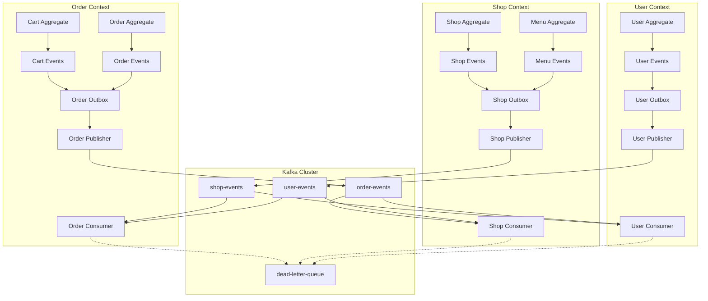
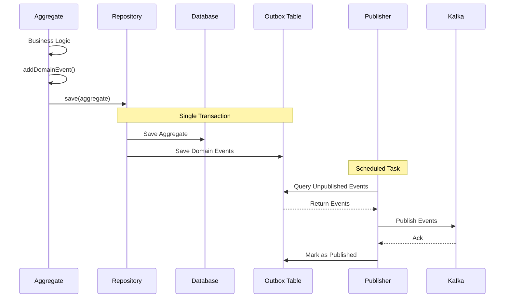

# Design Document

## Overview

트랜잭셔널 아웃박스 패턴과 Kafka를 활용한 이벤트 드리븐 아키텍처를 구현합니다. 현재 정의된 도메인 이벤트들에 실제 발행 및 소비 메커니즘을 추가하여, 바운디드 컨텍스트 간 안정적이고 확장 가능한 비동기 통신을 구현합니다.

## Architecture

### Event-Driven Architecture Overview



### Transactional Outbox Pattern



## Components and Interfaces

### Domain Event Infrastructure

#### Common Event Infrastructure

```java
// domains/common/src/main/java/harry/boilerplate/common/event/EventPublisher.java
public interface EventPublisher {
    void publish(DomainEvent event);
    void publishAll(List<DomainEvent> events);
}

// domains/common/src/main/java/harry/boilerplate/common/event/OutboxEvent.java
@Entity
@Table(name = "outbox_event")
public class OutboxEvent extends BaseEntity {
    @Id
    private String id;
    
    @Column(name = "aggregate_type")
    private String aggregateType;
    
    @Column(name = "aggregate_id")
    private String aggregateId;
    
    @Column(name = "event_type")
    private String eventType;
    
    @Column(name = "event_data", columnDefinition = "TEXT")
    private String eventData;
    
    @Column(name = "published")
    private boolean published = false;
    
    @Column(name = "published_at")
    private Instant publishedAt;
    
    @Column(name = "retry_count")
    private int retryCount = 0;
    
    public static OutboxEvent from(DomainEvent domainEvent) {
        return new OutboxEvent(
            UUID.randomUUID().toString(),
            domainEvent.getAggregateType(),
            domainEvent.getAggregateId(),
            domainEvent.getClass().getSimpleName(),
            JsonUtils.toJson(domainEvent)
        );
    }
    
    // constructors, getters...
}

// domains/common/src/main/java/harry/boilerplate/common/event/OutboxEventRepository.java
public interface OutboxEventRepository extends JpaRepository<OutboxEvent, String> {
    List<OutboxEvent> findByPublishedFalseAndRetryCountLessThanOrderByCreatedAt(int maxRetryCount);
    
    @Modifying
    @Query("UPDATE OutboxEvent o SET o.published = true, o.publishedAt = :publishedAt WHERE o.id = :id")
    void markAsPublished(@Param("id") String id, @Param("publishedAt") Instant publishedAt);
    
    @Modifying
    @Query("UPDATE OutboxEvent o SET o.retryCount = o.retryCount + 1 WHERE o.id = :id")
    void incrementRetryCount(@Param("id") String id);
}
```

#### Kafka Event Publisher

```java
// domains/common/src/main/java/harry/boilerplate/common/event/KafkaEventPublisher.java
@Component
@Slf4j
public class KafkaEventPublisher implements EventPublisher {
    private final KafkaTemplate<String, String> kafkaTemplate;
    private final ObjectMapper objectMapper;
    
    public KafkaEventPublisher(KafkaTemplate<String, String> kafkaTemplate, ObjectMapper objectMapper) {
        this.kafkaTemplate = kafkaTemplate;
        this.objectMapper = objectMapper;
    }
    
    @Override
    public void publish(DomainEvent event) {
        try {
            String topic = getTopicName(event);
            String key = event.getAggregateId();
            String payload = objectMapper.writeValueAsString(event);
            
            kafkaTemplate.send(topic, key, payload)
                .addCallback(
                    result -> log.info("Event published successfully: {} to topic: {}", 
                                     event.getClass().getSimpleName(), topic),
                    failure -> log.error("Failed to publish event: {} to topic: {}", 
                                       event.getClass().getSimpleName(), topic, failure)
                );
        } catch (Exception e) {
            log.error("Error publishing event: {}", event.getClass().getSimpleName(), e);
            throw new EventPublishException("Failed to publish event", e);
        }
    }
    
    @Override
    public void publishAll(List<DomainEvent> events) {
        events.forEach(this::publish);
    }
    
    private String getTopicName(DomainEvent event) {
        String aggregateType = event.getAggregateType().toLowerCase();
        return aggregateType + "-events";
    }
}
```

#### Outbox Event Publisher

```java
// domains/common/src/main/java/harry/boilerplate/common/event/OutboxEventPublisher.java
@Component
@Slf4j
public class OutboxEventPublisher {
    private final OutboxEventRepository outboxEventRepository;
    private final EventPublisher eventPublisher;
    private final ObjectMapper objectMapper;
    
    private static final int MAX_RETRY_COUNT = 3;
    
    @Scheduled(fixedDelay = 5000) // 5초마다 실행
    @Transactional
    public void publishPendingEvents() {
        List<OutboxEvent> pendingEvents = outboxEventRepository
            .findByPublishedFalseAndRetryCountLessThanOrderByCreatedAt(MAX_RETRY_COUNT);
        
        if (pendingEvents.isEmpty()) {
            return;
        }
        
        log.info("Publishing {} pending events", pendingEvents.size());
        
        for (OutboxEvent outboxEvent : pendingEvents) {
            try {
                DomainEvent domainEvent = deserializeEvent(outboxEvent);
                eventPublisher.publish(domainEvent);
                
                outboxEventRepository.markAsPublished(outboxEvent.getId(), Instant.now());
                log.info("Successfully published event: {}", outboxEvent.getEventType());
                
            } catch (Exception e) {
                log.error("Failed to publish event: {}, retry count: {}", 
                         outboxEvent.getEventType(), outboxEvent.getRetryCount(), e);
                
                outboxEventRepository.incrementRetryCount(outboxEvent.getId());
                
                if (outboxEvent.getRetryCount() + 1 >= MAX_RETRY_COUNT) {
                    log.error("Event {} exceeded max retry count, moving to DLQ", 
                             outboxEvent.getEventType());
                    // DLQ 처리 로직 추가 가능
                }
            }
        }
    }
    
    private DomainEvent deserializeEvent(OutboxEvent outboxEvent) throws Exception {
        Class<?> eventClass = Class.forName(getEventClassName(outboxEvent.getEventType()));
        return (DomainEvent) objectMapper.readValue(outboxEvent.getEventData(), eventClass);
    }
    
    private String getEventClassName(String eventType) {
        // 이벤트 타입에 따른 클래스명 매핑 로직
        // 예: MenuOpenedEvent -> harry.boilerplate.shop.command.domain.event.MenuOpenedEvent
        return "harry.boilerplate.shop.command.domain.event." + eventType;
    }
}
```

### Domain Event Registration

#### Enhanced AggregateRoot

```java
// domains/common/src/main/java/harry/boilerplate/common/domain/entity/AggregateRoot.java
@MappedSuperclass
public abstract class AggregateRoot<T extends AggregateRoot<T, TID>, TID> extends BaseEntity {
    @Transient
    private final List<DomainEvent> domainEvents = new ArrayList<>();
    
    protected void addDomainEvent(DomainEvent event) {
        this.domainEvents.add(event);
    }
    
    @DomainEvents
    public Collection<DomainEvent> getDomainEvents() {
        return Collections.unmodifiableList(domainEvents);
    }
    
    @AfterDomainEventPublication
    public void clearDomainEvents() {
        this.domainEvents.clear();
    }
    
    public abstract TID getId();
}
```

#### Domain Event Listener

```java
// domains/common/src/main/java/harry/boilerplate/common/event/DomainEventListener.java
@Component
@Transactional
@Slf4j
public class DomainEventListener {
    private final OutboxEventRepository outboxEventRepository;
    
    @EventListener
    public void handleDomainEvent(DomainEvent event) {
        log.info("Handling domain event: {} for aggregate: {}", 
                event.getClass().getSimpleName(), event.getAggregateId());
        
        OutboxEvent outboxEvent = OutboxEvent.from(event);
        outboxEventRepository.save(outboxEvent);
        
        log.info("Domain event saved to outbox: {}", event.getClass().getSimpleName());
    }
}
```

### Context-Specific Event Handlers

#### Shop Context Event Handlers

```java
// domains/shop/src/main/java/harry/boilerplate/shop/command/application/event/OrderEventHandler.java
@Component
@Slf4j
public class OrderEventHandler {
    private final ShopRepository shopRepository;
    private final ShopStatisticsService shopStatisticsService;
    
    @KafkaListener(topics = "order-events", groupId = "shop-service")
    public void handleOrderPlacedEvent(String message) {
        try {
            OrderPlacedEvent event = JsonUtils.fromJson(message, OrderPlacedEvent.class);
            log.info("Received OrderPlacedEvent for shop: {}", event.getShopId());
            
            // 가게 주문 통계 업데이트
            shopStatisticsService.updateOrderStatistics(
                event.getShopId(), 
                event.getTotalAmount()
            );
            
        } catch (Exception e) {
            log.error("Error handling OrderPlacedEvent", e);
            throw new EventProcessingException("Failed to process OrderPlacedEvent", e);
        }
    }
}

// domains/shop/src/main/java/harry/boilerplate/shop/command/application/service/ShopStatisticsService.java
@Service
@Transactional
public class ShopStatisticsService {
    private final ShopRepository shopRepository;
    
    public void updateOrderStatistics(String shopId, BigDecimal orderAmount) {
        Shop shop = shopRepository.find(new ShopId(shopId));
        if (shop != null) {
            shop.updateOrderStatistics(Money.of(orderAmount));
            shopRepository.save(shop);
            log.info("Updated order statistics for shop: {}", shopId);
        }
    }
}
```

#### Order Context Event Handlers

```java
// domains/order/src/main/java/harry/boilerplate/order/command/application/event/ShopEventHandler.java
@Component
@Slf4j
public class ShopEventHandler {
    private final CartRepository cartRepository;
    
    @KafkaListener(topics = "shop-events", groupId = "order-service")
    public void handleShopClosedEvent(String message) {
        try {
            ShopClosedEvent event = JsonUtils.fromJson(message, ShopClosedEvent.class);
            log.info("Received ShopClosedEvent for shop: {}", event.getShopId());
            
            // 해당 가게의 모든 활성 장바구니 비활성화
            List<Cart> activeCarts = cartRepository.findActiveCartsByShopId(event.getShopId());
            for (Cart cart : activeCarts) {
                cart.deactivate("Shop closed");
                cartRepository.save(cart);
            }
            
            log.info("Deactivated {} carts for closed shop: {}", 
                    activeCarts.size(), event.getShopId());
            
        } catch (Exception e) {
            log.error("Error handling ShopClosedEvent", e);
            throw new EventProcessingException("Failed to process ShopClosedEvent", e);
        }
    }
}

// domains/order/src/main/java/harry/boilerplate/order/command/application/event/UserEventHandler.java
@Component
@Slf4j
public class UserEventHandler {
    private final CartRepository cartRepository;
    
    @KafkaListener(topics = "user-events", groupId = "order-service")
    public void handleUserRegisteredEvent(String message) {
        try {
            UserRegisteredEvent event = JsonUtils.fromJson(message, UserRegisteredEvent.class);
            log.info("Received UserRegisteredEvent for user: {}", event.getUserId());
            
            // 신규 사용자를 위한 빈 장바구니 생성
            Cart newCart = Cart.createEmpty(new UserId(event.getUserId()));
            cartRepository.save(newCart);
            
            log.info("Created empty cart for new user: {}", event.getUserId());
            
        } catch (Exception e) {
            log.error("Error handling UserRegisteredEvent", e);
            throw new EventProcessingException("Failed to process UserRegisteredEvent", e);
        }
    }
}
```

#### User Context Event Handlers

```java
// domains/user/src/main/java/harry/boilerplate/user/command/application/event/OrderEventHandler.java
@Component
@Slf4j
public class OrderEventHandler {
    private final UserRepository userRepository;
    private final UserOrderHistoryService userOrderHistoryService;
    
    @KafkaListener(topics = "order-events", groupId = "user-service")
    public void handleOrderPlacedEvent(String message) {
        try {
            OrderPlacedEvent event = JsonUtils.fromJson(message, OrderPlacedEvent.class);
            log.info("Received OrderPlacedEvent for user: {}", event.getUserId());
            
            // 사용자 주문 이력 업데이트
            userOrderHistoryService.addOrderHistory(
                event.getUserId(),
                event.getOrderId(),
                event.getTotalAmount()
            );
            
        } catch (Exception e) {
            log.error("Error handling OrderPlacedEvent", e);
            throw new EventProcessingException("Failed to process OrderPlacedEvent", e);
        }
    }
}
```

## Data Models

### Outbox Event Schema

```sql
-- Outbox Event 테이블 (각 컨텍스트별로 생성)
CREATE TABLE outbox_event (
    id VARCHAR(36) PRIMARY KEY,
    aggregate_type VARCHAR(100) NOT NULL,
    aggregate_id VARCHAR(36) NOT NULL,
    event_type VARCHAR(100) NOT NULL,
    event_data TEXT NOT NULL,
    published BOOLEAN DEFAULT FALSE,
    published_at TIMESTAMP NULL,
    retry_count INT DEFAULT 0,
    created_at TIMESTAMP DEFAULT CURRENT_TIMESTAMP,
    updated_at TIMESTAMP DEFAULT CURRENT_TIMESTAMP ON UPDATE CURRENT_TIMESTAMP,
    
    INDEX idx_published_retry (published, retry_count),
    INDEX idx_created_at (created_at)
);
```

### Enhanced Domain Models

#### Shop Context Enhanced Models

```java
// domains/shop/src/main/java/harry/boilerplate/shop/command/domain/aggregate/Shop.java
@Entity
@Table(name = "shop")
public class Shop extends AggregateRoot<Shop, ShopId> {
    // 기존 필드들...
    
    @Column(name = "total_orders")
    private int totalOrders = 0;
    
    @Column(name = "total_revenue")
    private BigDecimal totalRevenue = BigDecimal.ZERO;
    
    public void updateOrderStatistics(Money orderAmount) {
        this.totalOrders++;
        this.totalRevenue = this.totalRevenue.add(orderAmount.getAmount());
        
        // 통계 업데이트 이벤트 발행 (선택적)
        addDomainEvent(new ShopStatisticsUpdatedEvent(
            this.getId().getValue(),
            this.totalOrders,
            this.totalRevenue
        ));
    }
    
    public void close(String reason) {
        // 기존 영업 종료 로직...
        
        // 가게 종료 이벤트 발행
        addDomainEvent(new ShopClosedEvent(
            this.getId().getValue(),
            this.name,
            reason
        ));
    }
}
```

#### Order Context Enhanced Models

```java
// domains/order/src/main/java/harry/boilerplate/order/command/domain/aggregate/Cart.java
@Entity
@Table(name = "cart")
public class Cart extends AggregateRoot<Cart, CartId> {
    // 기존 필드들...
    
    @Column(name = "active")
    private boolean active = true;
    
    @Column(name = "deactivation_reason")
    private String deactivationReason;
    
    public void deactivate(String reason) {
        this.active = false;
        this.deactivationReason = reason;
        
        addDomainEvent(new CartDeactivatedEvent(
            this.getId().getValue(),
            this.userId.getValue(),
            reason
        ));
    }
    
    public static Cart createEmpty(UserId userId) {
        Cart cart = new Cart(CartId.generate(), userId);
        
        addDomainEvent(new EmptyCartCreatedEvent(
            cart.getId().getValue(),
            userId.getValue()
        ));
        
        return cart;
    }
}
```

## Error Handling

### Event Processing Error Handling

```java
// domains/common/src/main/java/harry/boilerplate/common/event/EventProcessingException.java
public class EventProcessingException extends RuntimeException {
    private final String eventType;
    private final String aggregateId;
    
    public EventProcessingException(String message, String eventType, String aggregateId) {
        super(message);
        this.eventType = eventType;
        this.aggregateId = aggregateId;
    }
    
    public EventProcessingException(String message, Throwable cause) {
        super(message, cause);
        this.eventType = null;
        this.aggregateId = null;
    }
    
    // getters...
}

// domains/common/src/main/java/harry/boilerplate/common/event/EventErrorHandler.java
@Component
@Slf4j
public class EventErrorHandler {
    private final KafkaTemplate<String, String> kafkaTemplate;
    
    @EventListener
    public void handleEventProcessingError(EventProcessingException exception) {
        log.error("Event processing failed: {}", exception.getMessage(), exception);
        
        // DLQ로 메시지 전송
        try {
            ErrorEvent errorEvent = new ErrorEvent(
                exception.getEventType(),
                exception.getAggregateId(),
                exception.getMessage(),
                Instant.now()
            );
            
            kafkaTemplate.send("dead-letter-queue", 
                              JsonUtils.toJson(errorEvent));
                              
        } catch (Exception e) {
            log.error("Failed to send error event to DLQ", e);
        }
    }
}
```

### Kafka Configuration

```java
// domains/common/src/main/java/harry/boilerplate/common/config/KafkaConfig.java
@Configuration
@EnableKafka
public class KafkaConfig {
    
    @Value("${spring.kafka.bootstrap-servers}")
    private String bootstrapServers;
    
    @Bean
    public ProducerFactory<String, String> producerFactory() {
        Map<String, Object> configProps = new HashMap<>();
        configProps.put(ProducerConfig.BOOTSTRAP_SERVERS_CONFIG, bootstrapServers);
        configProps.put(ProducerConfig.KEY_SERIALIZER_CLASS_CONFIG, StringSerializer.class);
        configProps.put(ProducerConfig.VALUE_SERIALIZER_CLASS_CONFIG, StringSerializer.class);
        configProps.put(ProducerConfig.ACKS_CONFIG, "all");
        configProps.put(ProducerConfig.RETRIES_CONFIG, 3);
        configProps.put(ProducerConfig.ENABLE_IDEMPOTENCE_CONFIG, true);
        
        return new DefaultKafkaProducerFactory<>(configProps);
    }
    
    @Bean
    public KafkaTemplate<String, String> kafkaTemplate() {
        return new KafkaTemplate<>(producerFactory());
    }
    
    @Bean
    public ConsumerFactory<String, String> consumerFactory() {
        Map<String, Object> props = new HashMap<>();
        props.put(ConsumerConfig.BOOTSTRAP_SERVERS_CONFIG, bootstrapServers);
        props.put(ConsumerConfig.GROUP_ID_CONFIG, "default-group");
        props.put(ConsumerConfig.KEY_DESERIALIZER_CLASS_CONFIG, StringDeserializer.class);
        props.put(ConsumerConfig.VALUE_DESERIALIZER_CLASS_CONFIG, StringDeserializer.class);
        props.put(ConsumerConfig.AUTO_OFFSET_RESET_CONFIG, "earliest");
        props.put(ConsumerConfig.ENABLE_AUTO_COMMIT_CONFIG, false);
        props.put(ConsumerConfig.ISOLATION_LEVEL_CONFIG, "read_committed");
        
        return new DefaultKafkaConsumerFactory<>(props);
    }
    
    @Bean
    public ConcurrentKafkaListenerContainerFactory<String, String> kafkaListenerContainerFactory() {
        ConcurrentKafkaListenerContainerFactory<String, String> factory = 
            new ConcurrentKafkaListenerContainerFactory<>();
        factory.setConsumerFactory(consumerFactory());
        factory.getContainerProperties().setAckMode(ContainerProperties.AckMode.MANUAL_IMMEDIATE);
        
        // 에러 핸들링 설정
        factory.setErrorHandler(new SeekToCurrentErrorHandler(
            new DeadLetterPublishingRecoverer(kafkaTemplate()), 
            new FixedBackOff(1000L, 3)
        ));
        
        return factory;
    }
}
```

## Testing Strategy

### Event Testing Infrastructure

```java
// domains/common/src/test/java/harry/boilerplate/common/event/EventTestUtils.java
@TestComponent
public class EventTestUtils {
    
    @Autowired
    private ApplicationEventPublisher eventPublisher;
    
    @Autowired
    private OutboxEventRepository outboxEventRepository;
    
    public void publishAndWaitForOutbox(DomainEvent event) {
        eventPublisher.publishEvent(event);
        
        // Outbox에 저장될 때까지 대기
        await().atMost(Duration.ofSeconds(5))
               .until(() -> outboxEventRepository
                   .findByAggregateIdAndEventType(
                       event.getAggregateId(), 
                       event.getClass().getSimpleName())
                   .isPresent());
    }
    
    public void verifyEventInOutbox(String aggregateId, String eventType) {
        Optional<OutboxEvent> outboxEvent = outboxEventRepository
            .findByAggregateIdAndEventType(aggregateId, eventType);
        
        assertThat(outboxEvent).isPresent();
        assertThat(outboxEvent.get().isPublished()).isFalse();
    }
}

// Integration Test Example
@SpringBootTest
@Testcontainers
class EventDrivenIntegrationTest {
    
    @Container
    static KafkaContainer kafka = new KafkaContainer(DockerImageName.parse("confluentinc/cp-kafka:latest"));
    
    @Autowired
    private MenuRepository menuRepository;
    
    @Autowired
    private EventTestUtils eventTestUtils;
    
    @Test
    void 메뉴_공개시_이벤트_발행_및_아웃박스_저장() {
        // Given
        Menu menu = createTestMenu();
        menuRepository.save(menu);
        
        // When
        menu.open();
        menuRepository.save(menu);
        
        // Then
        eventTestUtils.verifyEventInOutbox(
            menu.getId().getValue(), 
            "MenuOpenedEvent"
        );
    }
}
```

이 설계 문서는 트랜잭셔널 아웃박스 패턴과 Kafka를 활용한 완전한 이벤트 드리븐 아키텍처를 제시합니다. 각 바운디드 컨텍스트 간의 안정적인 비동기 통신과 함께 장애 상황에서의 복구 메커니즘까지 포함하고 있습니다.