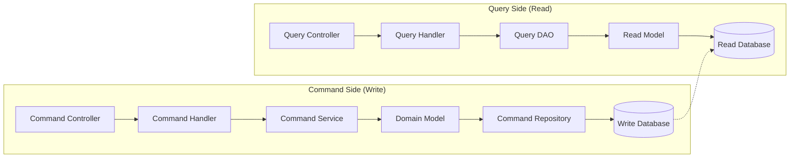

# Design Document

## Overview

음식 주문 시스템은 DDD(Domain-Driven Design)와 CQRS(Command Query Responsibility Segregation) 패턴을 적용한 멀티 프로젝트 구조로 설계됩니다. 시스템은 3개의 독립적인 바운디드 컨텍스트로 구성되며, 각각 별도의 Spring Boot 애플리케이션으로 실행되어 완전한 의존성 격리와 독립적 배포를 지원합니다.

## Architecture

### High-Level Architecture

```mermaid
graph TB
    subgraph "Client Layer"
        WEB[Web Client]
        MOBILE[Mobile Client]
    end
    
    subgraph "API Gateway"
        GATEWAY[API Gateway/Load Balancer]
    end
    
    subgraph "Bounded Contexts"
        subgraph "Shop Context :8081"
            SHOP_CMD[Shop Command API]
            SHOP_QRY[Shop Query API]
            SHOP_APP[Shop Application Layer]
            SHOP_DOM[Shop Domain Layer]
            SHOP_INF[Shop Infrastructure Layer]
        end
        
        subgraph "Order Context :8082"
            ORDER_CMD[Order Command API]
            ORDER_QRY[Order Query API]
            ORDER_APP[Order Application Layer]
            ORDER_DOM[Order Domain Layer]
            ORDER_INF[Order Infrastructure Layer]
        end
        
        subgraph "User Context :8083"
            USER_CMD[User Command API]
            USER_QRY[User Query API]
            USER_APP[User Application Layer]
            USER_DOM[User Domain Layer]
            USER_INF[User Infrastructure Layer]
        end
    end
    
    subgraph "Common Module"
        COMMON[Common Domain Patterns]
        COMMON_EXC[Common Exception Handling]
        COMMON_RESP[Common Response Patterns]
    end
    
    subgraph "Database Layer"
        MYSQL[(MySQL 8.0)]
    end
    
    WEB --> GATEWAY
    MOBILE --> GATEWAY
    GATEWAY --> SHOP_CMD
    GATEWAY --> SHOP_QRY
    GATEWAY --> ORDER_CMD
    GATEWAY --> ORDER_QRY
    GATEWAY --> USER_CMD
    GATEWAY --> USER_QRY
    
    SHOP_APP --> SHOP_DOM
    SHOP_APP --> SHOP_INF
    ORDER_APP --> ORDER_DOM
    ORDER_APP --> ORDER_INF
    USER_APP --> USER_DOM
    USER_APP --> USER_INF
    
    SHOP_DOM --> COMMON
    ORDER_DOM --> COMMON
    USER_DOM --> COMMON
    
    SHOP_INF --> MYSQL
    ORDER_INF --> MYSQL
    USER_INF --> MYSQL
```



### CQRS Architecture Pattern



## Components and Interfaces

### Shop Context Components

#### Domain Layer
```java
// Aggregate Root
public class Shop extends AggregateRoot<Shop, ShopId> {
    private ShopId id;
    private String name;
    private Money minOrderAmount;
    private Map<DayOfWeek, BusinessHours> operatingHours;
    
    // Core Business Methods
    public boolean isOpen();
    public void setOperatingHours(DayOfWeek dayOfWeek, BusinessHours hours);
    public void adjustOperatingHours(DayOfWeek dayOfWeek, BusinessHours newHours);
}

public class Menu extends AggregateRoot<Menu, MenuId> {
    private MenuId id;
    private ShopId shopId;
    private String name;
    private String description;
    private Money basePrice;
    private boolean isOpen;
    private List<OptionGroup> optionGroups;
    
    // Core Business Methods
    public void open();
    public void addOptionGroup(OptionGroup optionGroup);
    public void changeOptionGroupName(OptionGroupId id, String newName);
    public void changeOptionName(OptionGroupId groupId, String currentName, Money currentPrice, String newName);
    public void removeOptionGroup(OptionGroupId id);
}

// Value Objects
public class BusinessHours extends ValueObject {
    private final LocalTime openTime;
    private final LocalTime closeTime;
}

public class OptionGroup extends ValueObject {
    private final OptionGroupId id;
    private final String name;
    private final boolean isRequired;
    private final List<Option> options;
}
```

#### Application Layer
```java
// Command Handlers
@Component
@Transactional
public class CreateMenuCommandHandler {
    public void handle(CreateMenuCommand command);
}

@Component
@Transactional
public class OpenMenuCommandHandler {
    public void handle(OpenMenuCommand command);
}

// Query Handlers
@Component
@Transactional(readOnly = true)
public class MenuBoardQueryHandler {
    public MenuBoardResult handle(MenuBoardQuery query);
}

// Command DTOs
public class CreateMenuCommand {
    private final String shopId;
    private final String name;
    private final String description;
    private final BigDecimal basePrice;
}

// Query DTOs
public class MenuBoardQuery {
    private final String shopId;
}

public class MenuBoardResult {
    private final String shopId;
    private final String shopName;
    private final boolean isOpen;
    private final BigDecimal minOrderAmount;
    private final List<MenuSummaryReadModel> menus;
}
```

#### Infrastructure Layer
```java
// Command Repository
@Repository
@Transactional
public class MenuRepositoryImpl implements MenuRepository {
    @PersistenceContext
    private EntityManager entityManager;
    
    public Menu find(MenuId menuId);
    public void save(Menu menu);
}

// Query DAO
@Repository
@Transactional(readOnly = true)
public class MenuQueryDaoImpl implements MenuQueryDao {
    @PersistenceContext
    private EntityManager entityManager;
    
    public List<MenuSummaryReadModel> findMenuSummariesByShopId(String shopId);
    public MenuBoardViewModel getMenuBoard(String shopId);
}
```

### Order Context Components

#### Domain Layer
```java
public class Cart extends AggregateRoot<Cart, CartId> {
    private CartId id;
    private UserId userId;
    private ShopId shopId;
    private List<CartLineItem> items;
    
    // Core Business Methods
    public void start(ShopId newShopId);
    public void addItem(MenuId menuId, List<OptionId> selectedOptions, int quantity);
    public Money getTotalPrice();
    public Order placeOrder();
}

public class Order extends AggregateRoot<Order, OrderId> {
    private OrderId id;
    private UserId userId;
    private ShopId shopId;
    private List<OrderLineItem> items;
    private LocalDateTime orderTime;
    private Money totalPrice;
    
    // Core Business Methods
    public Money getPrice();
}

public class CartLineItem extends ValueObject {
    private final MenuId menuId;
    private final List<OptionId> selectedOptions;
    private int quantity;
    
    // Core Business Methods
    public CartLineItem combine(CartLineItem other);
    public boolean isSameMenuAndOptions(CartLineItem other);
}
```

#### Application Layer
```java
// Command Handlers
@Component
@Transactional
public class AddCartItemCommandHandler {
    public void handle(AddCartItemCommand command);
}

@Component
@Transactional
public class PlaceOrderCommandHandler {
    public void handle(PlaceOrderCommand command);
}

// Query Handlers
@Component
@Transactional(readOnly = true)
public class CartSummaryQueryHandler {
    public CartSummaryResult handle(CartSummaryQuery query);
}
```

### User Context Components

#### Domain Layer
```java
public class User extends AggregateRoot<User, UserId> {
    private UserId id;
    private String name;
    private String email;
    
    // Core Business Methods
    public boolean isValid();
}
```

### Inter-Context Communication

#### API Client Interfaces
```java
// Shop Context API Client (used by Order Context)
public interface ShopApiClient {
    ShopInfoResponse getShop(String shopId);
    MenuInfoResponse getMenu(String menuId);
    boolean isShopOpen(String shopId);
    List<OptionInfoResponse> getMenuOptions(String menuId);
}

// User Context API Client (used by Order Context)
public interface UserApiClient {
    UserInfoResponse getUser(String userId);
    boolean isValidUser(String userId);
}
```

#### Domain Event Communication

각 바운디드 컨텍스트는 중요한 비즈니스 이벤트를 도메인 이벤트로 발행하여 다른 컨텍스트에 알립니다.

##### Shop Context Domain Events
```java
// domains/shop/src/main/java/harry/boilerplate/shop/domain/event/MenuOpenedEvent.java
public class MenuOpenedEvent implements DomainEvent {
    private final UUID eventId = UUID.randomUUID();
    private final Instant occurredAt = Instant.now();
    private final String aggregateId; // menuId
    private final String aggregateType = "Menu";
    private final int version = 1;
    
    private final String shopId;
    private final String menuName;
    
    public MenuOpenedEvent(String menuId, String shopId, String menuName) {
        this.aggregateId = menuId;
        this.shopId = shopId;
        this.menuName = menuName;
    }
    
    // getters...
}

// domains/shop/src/main/java/harry/boilerplate/shop/domain/event/ShopClosedEvent.java
public class ShopClosedEvent implements DomainEvent {
    private final UUID eventId = UUID.randomUUID();
    private final Instant occurredAt = Instant.now();
    private final String aggregateId; // shopId
    private final String aggregateType = "Shop";
    private final int version = 1;
    
    private final String shopName;
    private final String reason;
    
    public ShopClosedEvent(String shopId, String shopName, String reason) {
        this.aggregateId = shopId;
        this.shopName = shopName;
        this.reason = reason;
    }
    
    // getters...
}
```

##### Order Context Domain Events
```java
// domains/order/src/main/java/harry/boilerplate/order/domain/event/OrderPlacedEvent.java
public class OrderPlacedEvent implements DomainEvent {
    private final UUID eventId = UUID.randomUUID();
    private final Instant occurredAt = Instant.now();
    private final String aggregateId; // orderId
    private final String aggregateType = "Order";
    private final int version = 1;
    
    private final String userId;
    private final String shopId;
    private final BigDecimal totalAmount;
    
    public OrderPlacedEvent(String orderId, String userId, String shopId, BigDecimal totalAmount) {
        this.aggregateId = orderId;
        this.userId = userId;
        this.shopId = shopId;
        this.totalAmount = totalAmount;
    }
    
    // getters...
}

// domains/order/src/main/java/harry/boilerplate/order/domain/event/CartItemAddedEvent.java
public class CartItemAddedEvent implements DomainEvent {
    private final UUID eventId = UUID.randomUUID();
    private final Instant occurredAt = Instant.now();
    private final String aggregateId; // cartId
    private final String aggregateType = "Cart";
    private final int version = 1;
    
    private final String userId;
    private final String menuId;
    private final int quantity;
    
    public CartItemAddedEvent(String cartId, String userId, String menuId, int quantity) {
        this.aggregateId = cartId;
        this.userId = userId;
        this.menuId = menuId;
        this.quantity = quantity;
    }
    
    // getters...
}
```

##### User Context Domain Events
```java
// domains/user/src/main/java/harry/boilerplate/user/domain/event/UserRegisteredEvent.java
public class UserRegisteredEvent implements DomainEvent {
    private final UUID eventId = UUID.randomUUID();
    private final Instant occurredAt = Instant.now();
    private final String aggregateId; // userId
    private final String aggregateType = "User";
    private final int version = 1;
    
    private final String userName;
    private final String email;
    
    public UserRegisteredEvent(String userId, String userName, String email) {
        this.aggregateId = userId;
        this.userName = userName;
        this.email = email;
    }
    
    // getters...
}
```

##### Domain Event Usage in Aggregates
```java
// Shop Context - Menu Aggregate
public class Menu extends AggregateRoot<Menu, MenuId> {
    public void open() {
        // 비즈니스 규칙 검증
        validateOpenConditions();
        
        // 상태 변경
        this.isOpen = true;
        
        // 도메인 이벤트 발행
        addDomainEvent(new MenuOpenedEvent(
            this.getId().getValue(),
            this.shopId.getValue(),
            this.name
        ));
    }
}

// Order Context - Order Aggregate
public class Order extends AggregateRoot<Order, OrderId> {
    public static Order from(Cart cart) {
        Order order = new Order(cart.getUserId(), cart.getShopId(), cart.getItems());
        
        // 도메인 이벤트 발행
        order.addDomainEvent(new OrderPlacedEvent(
            order.getId().getValue(),
            order.getUserId().getValue(),
            order.getShopId().getValue(),
            order.getTotalPrice().getAmount()
        ));
        
        return order;
    }
}
```

## Data Models

### Database Schema Design

#### Shop Context Tables
```sql
-- Shop aggregate
CREATE TABLE shop (
    id VARCHAR(36) PRIMARY KEY DEFAULT (UUID()),
    name VARCHAR(255) NOT NULL,
    min_order_amount DECIMAL(10,2),
    created_at TIMESTAMP DEFAULT CURRENT_TIMESTAMP,
    updated_at TIMESTAMP DEFAULT CURRENT_TIMESTAMP ON UPDATE CURRENT_TIMESTAMP
);

-- Operating hours (embedded in Shop)
CREATE TABLE shop_operating_hours (
    shop_id VARCHAR(36) NOT NULL,
    day_of_week TINYINT NOT NULL, -- 1=Monday, 7=Sunday
    open_time TIME,
    close_time TIME,
    PRIMARY KEY (shop_id, day_of_week),
    FOREIGN KEY (shop_id) REFERENCES shop(id)
);

-- Menu aggregate
CREATE TABLE menu (
    id VARCHAR(36) PRIMARY KEY DEFAULT (UUID()),
    shop_id VARCHAR(36) NOT NULL,
    name VARCHAR(255) NOT NULL,
    description TEXT,
    base_price DECIMAL(10,2),
    is_open BOOLEAN DEFAULT FALSE,
    created_at TIMESTAMP DEFAULT CURRENT_TIMESTAMP,
    updated_at TIMESTAMP DEFAULT CURRENT_TIMESTAMP ON UPDATE CURRENT_TIMESTAMP,
    FOREIGN KEY (shop_id) REFERENCES shop(id)
);

-- Option groups (part of Menu aggregate)
CREATE TABLE option_group (
    id VARCHAR(36) PRIMARY KEY DEFAULT (UUID()),
    menu_id VARCHAR(36) NOT NULL,
    name VARCHAR(255) NOT NULL,
    is_required BOOLEAN DEFAULT FALSE,
    created_at TIMESTAMP DEFAULT CURRENT_TIMESTAMP,
    FOREIGN KEY (menu_id) REFERENCES menu(id),
    UNIQUE KEY unique_option_group_name_per_menu (menu_id, name)
);

-- Options (part of OptionGroup)
CREATE TABLE option (
    id VARCHAR(36) PRIMARY KEY DEFAULT (UUID()),
    option_group_id VARCHAR(36) NOT NULL,
    name VARCHAR(255) NOT NULL,
    price DECIMAL(10,2) DEFAULT 0,
    created_at TIMESTAMP DEFAULT CURRENT_TIMESTAMP,
    FOREIGN KEY (option_group_id) REFERENCES option_group(id)
);
```

#### Order Context Tables
```sql
-- Cart aggregate
CREATE TABLE cart (
    id VARCHAR(36) PRIMARY KEY DEFAULT (UUID()),
    user_id VARCHAR(36) NOT NULL,
    shop_id VARCHAR(36),
    created_at TIMESTAMP DEFAULT CURRENT_TIMESTAMP,
    updated_at TIMESTAMP DEFAULT CURRENT_TIMESTAMP ON UPDATE CURRENT_TIMESTAMP
);

-- Cart line items (part of Cart aggregate)
CREATE TABLE cart_line_item (
    id VARCHAR(36) PRIMARY KEY DEFAULT (UUID()),
    cart_id VARCHAR(36) NOT NULL,
    menu_id VARCHAR(36) NOT NULL,
    quantity INT NOT NULL DEFAULT 1,
    created_at TIMESTAMP DEFAULT CURRENT_TIMESTAMP,
    FOREIGN KEY (cart_id) REFERENCES cart(id)
);

-- Selected options for cart items
CREATE TABLE cart_item_selected_option (
    cart_line_item_id VARCHAR(36) NOT NULL,
    option_id VARCHAR(36) NOT NULL,
    PRIMARY KEY (cart_line_item_id, option_id),
    FOREIGN KEY (cart_line_item_id) REFERENCES cart_line_item(id)
);

-- Order aggregate
CREATE TABLE order_table (
    id VARCHAR(36) PRIMARY KEY DEFAULT (UUID()),
    user_id VARCHAR(36) NOT NULL,
    shop_id VARCHAR(36) NOT NULL,
    total_price DECIMAL(10,2),
    order_time TIMESTAMP DEFAULT CURRENT_TIMESTAMP
);

-- Order line items (part of Order aggregate)
CREATE TABLE order_line_item (
    id VARCHAR(36) PRIMARY KEY DEFAULT (UUID()),
    order_id VARCHAR(36) NOT NULL,
    menu_id VARCHAR(36) NOT NULL,
    menu_name VARCHAR(255) NOT NULL,
    quantity INT NOT NULL DEFAULT 1,
    line_price DECIMAL(10,2),
    created_at TIMESTAMP DEFAULT CURRENT_TIMESTAMP,
    FOREIGN KEY (order_id) REFERENCES order_table(id)
);

-- Selected options for order items (snapshot)
CREATE TABLE order_item_selected_option (
    order_line_item_id VARCHAR(36) NOT NULL,
    option_id VARCHAR(36) NOT NULL,
    option_name VARCHAR(255) NOT NULL,
    option_price DECIMAL(10,2) NOT NULL,
    PRIMARY KEY (order_line_item_id, option_id),
    FOREIGN KEY (order_line_item_id) REFERENCES order_line_item(id)
);
```

#### User Context Tables
```sql
-- User aggregate
CREATE TABLE user (
    id VARCHAR(36) PRIMARY KEY DEFAULT (UUID()),
    name VARCHAR(255) NOT NULL,
    email VARCHAR(255) UNIQUE,
    created_at TIMESTAMP DEFAULT CURRENT_TIMESTAMP,
    updated_at TIMESTAMP DEFAULT CURRENT_TIMESTAMP ON UPDATE CURRENT_TIMESTAMP
);
```

### Read Models

#### Shop Context Read Models
```java
public class MenuSummaryReadModel {
    private final String menuId;
    private final String name;
    private final BigDecimal basePrice;
    private final String description;
    private final boolean isOpen;
}

public class MenuBoardViewModel {
    private final String shopId;
    private final String shopName;
    private final boolean isShopOpen;
    private final BigDecimal minOrderAmount;
    private final List<MenuSummaryReadModel> menus;
}

public class MenuDetailReadModel {
    private final String menuId;
    private final String name;
    private final String description;
    private final BigDecimal basePrice;
    private final List<OptionGroupReadModel> optionGroups;
}
```

#### Order Context Read Models
```java
public class CartSummaryReadModel {
    private final String cartId;
    private final String userId;
    private final String shopId;
    private final String shopName;
    private final List<CartItemReadModel> items;
    private final BigDecimal totalPrice;
}

public class OrderHistoryReadModel {
    private final String orderId;
    private final String shopName;
    private final LocalDateTime orderTime;
    private final BigDecimal totalPrice;
    private final List<OrderItemReadModel> items;
}
```

## Error Handling

### Error Code Strategy

#### Domain-Specific Error Codes
```java
// Shop Context Error Codes
public enum ShopErrorCode implements ErrorCode {
    SHOP_NOT_FOUND("SHOP-DOMAIN-001", "가게를 찾을 수 없습니다"),
    SHOP_NOT_OPEN("SHOP-DOMAIN-002", "가게가 영업 중이 아닙니다"),
    INVALID_OPERATING_HOURS("SHOP-DOMAIN-003", "잘못된 영업시간입니다");
}

public enum MenuErrorCode implements ErrorCode {
    MENU_NOT_FOUND("MENU-DOMAIN-001", "메뉴를 찾을 수 없습니다"),
    MENU_ALREADY_OPEN("MENU-DOMAIN-002", "이미 공개된 메뉴입니다"),
    INSUFFICIENT_OPTION_GROUPS("MENU-DOMAIN-003", "옵션그룹이 부족합니다"),
    DUPLICATE_OPTION_GROUP_NAME("MENU-DOMAIN-004", "중복된 옵션그룹 이름입니다"),
    MAX_REQUIRED_OPTION_GROUPS_EXCEEDED("MENU-DOMAIN-005", "필수 옵션그룹 최대 개수를 초과했습니다");
}

// Order Context Error Codes
public enum CartErrorCode implements ErrorCode {
    CART_NOT_FOUND("CART-DOMAIN-001", "장바구니를 찾을 수 없습니다"),
    DIFFERENT_SHOP_MENU("CART-DOMAIN-002", "다른 가게의 메뉴는 추가할 수 없습니다"),
    EMPTY_CART("CART-DOMAIN-003", "장바구니가 비어있습니다"),
    MINIMUM_ORDER_AMOUNT_NOT_MET("CART-DOMAIN-004", "최소 주문금액을 충족하지 않습니다");
}

public enum OrderErrorCode implements ErrorCode {
    ORDER_NOT_FOUND("ORDER-DOMAIN-001", "주문을 찾을 수 없습니다"),
    INVALID_ORDER_STATE("ORDER-DOMAIN-002", "잘못된 주문 상태입니다");
}
```

#### Exception Hierarchy
```java
// Domain Exceptions
public class ShopDomainException extends DomainException {
    private final ShopErrorCode errorCode;
    
    public ShopDomainException(ShopErrorCode errorCode) {
        super(errorCode.getMessage(), null);
        this.errorCode = errorCode;
    }
    
    @Override
    public ErrorCode getErrorCode() {
        return errorCode;
    }
}

public class MenuDomainException extends DomainException {
    private final MenuErrorCode errorCode;
    
    public MenuDomainException(MenuErrorCode errorCode) {
        super(errorCode.getMessage(), null);
        this.errorCode = errorCode;
    }
    
    @Override
    public ErrorCode getErrorCode() {
        return errorCode;
    }
}

// Application Exceptions
public class ShopApplicationException extends ApplicationException {
    private final ShopErrorCode errorCode;
    
    public ShopApplicationException(ShopErrorCode errorCode, Throwable cause) {
        super(errorCode.getMessage(), cause);
        this.errorCode = errorCode;
    }
    
    @Override
    public ErrorCode getErrorCode() {
        return errorCode;
    }
}
```

### Global Exception Handler
```java
@RestControllerAdvice
public class GlobalExceptionHandler {
    
    @ExceptionHandler(DomainException.class)
    public ResponseEntity<ErrorResponse> handleDomainException(DomainException e) {
        ErrorResponse response = new ErrorResponse(
            e.getErrorCode().getCode(),
            e.getErrorCode().getMessage(),
            Instant.now()
        );
        return ResponseEntity.badRequest().body(response);
    }
    
    @ExceptionHandler(ApplicationException.class)
    public ResponseEntity<ErrorResponse> handleApplicationException(ApplicationException e) {
        ErrorResponse response = new ErrorResponse(
            e.getErrorCode().getCode(),
            e.getErrorCode().getMessage(),
            Instant.now()
        );
        return ResponseEntity.status(HttpStatus.INTERNAL_SERVER_ERROR).body(response);
    }
}
```

## Testing Strategy

### Unit Testing Strategy

#### Domain Layer Testing
```java
// Domain Model Unit Tests
@Test
class MenuTest {
    @Test
    void 메뉴_공개_성공_모든_조건_만족() {
        // Given
        Menu menu = createMenuWithValidOptionGroups();
        
        // When
        menu.open();
        
        // Then
        assertThat(menu.isOpen()).isTrue();
    }
    
    @Test
    void 메뉴_공개_실패_옵션그룹_부족() {
        // Given
        Menu menu = createMenuWithoutOptionGroups();
        
        // When & Then
        assertThatThrownBy(() -> menu.open())
            .isInstanceOf(MenuDomainException.class)
            .extracting(e -> ((MenuDomainException) e).getErrorCode())
            .isEqualTo(MenuErrorCode.INSUFFICIENT_OPTION_GROUPS);
    }
}

// Value Object Unit Tests
@Test
class CartLineItemTest {
    @Test
    void 동일한_메뉴와_옵션_조합_병합_성공() {
        // Given
        CartLineItem item1 = new CartLineItem(menuId, options, 2);
        CartLineItem item2 = new CartLineItem(menuId, options, 3);
        
        // When
        CartLineItem combined = item1.combine(item2);
        
        // Then
        assertThat(combined.getQuantity()).isEqualTo(5);
    }
}
```

#### Application Layer Testing
```java
// Command Handler Tests
@ExtendWith(MockitoExtension.class)
class CreateMenuCommandHandlerTest {
    @Mock
    private MenuRepository menuRepository;
    
    @Mock
    private ShopRepository shopRepository;
    
    @InjectMocks
    private CreateMenuCommandHandler handler;
    
    @Test
    void 메뉴_생성_성공() {
        // Given
        CreateMenuCommand command = new CreateMenuCommand(shopId, "삼겹살", "맛있는 삼겹살", new BigDecimal("15000"));
        Shop shop = createValidShop();
        when(shopRepository.find(any())).thenReturn(shop);
        
        // When
        handler.handle(command);
        
        // Then
        verify(menuRepository).save(any(Menu.class));
    }
}

// Query Handler Tests
@ExtendWith(MockitoExtension.class)
class MenuBoardQueryHandlerTest {
    @Mock
    private MenuQueryDao menuQueryDao;
    
    @InjectMocks
    private MenuBoardQueryHandler handler;
    
    @Test
    void 메뉴보드_조회_성공() {
        // Given
        MenuBoardQuery query = new MenuBoardQuery(shopId);
        MenuBoardViewModel viewModel = createMenuBoardViewModel();
        when(menuQueryDao.getMenuBoard(shopId)).thenReturn(viewModel);
        
        // When
        MenuBoardResult result = handler.handle(query);
        
        // Then
        assertThat(result.getMenus()).isNotEmpty();
        assertThat(result.getShopName()).isEqualTo("테스트 가게");
    }
}
```

### Integration Testing Strategy

#### Repository Integration Tests
```java
@DataJpaTest
@AutoConfigureTestDatabase(replace = AutoConfigureTestDatabase.Replace.NONE)
@Testcontainers
class MenuRepositoryImplTest {
    @Container
    static MySQLContainer<?> mysql = new MySQLContainer<>("mysql:8.0")
            .withDatabaseName("test_db")
            .withUsername("test_user")
            .withPassword("test_password");
    
    @Autowired
    private TestEntityManager entityManager;
    
    @Autowired
    private MenuRepositoryImpl menuRepository;
    
    @Test
    void 메뉴_저장_및_조회_성공() {
        // Given
        Menu menu = createTestMenu();
        
        // When
        menuRepository.save(menu);
        entityManager.flush();
        Menu found = menuRepository.find(menu.getId());
        
        // Then
        assertThat(found).isNotNull();
        assertThat(found.getName()).isEqualTo(menu.getName());
    }
}
```

#### API Integration Tests
```java
@SpringBootTest(webEnvironment = SpringBootTest.WebEnvironment.RANDOM_PORT)
@Testcontainers
class MenuCommandControllerIntegrationTest {
    @Container
    static MySQLContainer<?> mysql = new MySQLContainer<>("mysql:8.0");
    
    @Autowired
    private TestRestTemplate restTemplate;
    
    @Test
    void 메뉴_생성_API_성공() {
        // Given
        CreateMenuRequest request = new CreateMenuRequest(shopId, "삼겹살", "맛있는 삼겹살", new BigDecimal("15000"));
        
        // When
        ResponseEntity<CommandResultResponse> response = restTemplate.postForEntity(
            "/shops/{shopId}/menus", request, CommandResultResponse.class, shopId);
        
        // Then
        assertThat(response.getStatusCode()).isEqualTo(HttpStatus.CREATED);
        assertThat(response.getBody().getStatus()).isEqualTo("SUCCESS");
        assertThat(response.getBody().getResourceId()).isNotNull();
    }
}
```

### End-to-End Testing Strategy

#### Cross-Context Integration Tests
```java
@SpringBootTest
@Testcontainers
class OrderPlacementE2ETest {
    @Container
    static MySQLContainer<?> mysql = new MySQLContainer<>("mysql:8.0");
    
    @Test
    void 주문_전체_플로우_성공() {
        // Given: Shop Context에서 가게와 메뉴 생성
        String shopId = createShopWithMenus();
        
        // And: User Context에서 사용자 생성
        String userId = createUser();
        
        // When: Order Context에서 장바구니에 메뉴 추가
        addItemToCart(userId, shopId, menuId, options);
        
        // And: 주문 생성
        String orderId = placeOrder(userId);
        
        // Then: 주문이 정상적으로 생성됨
        assertThat(orderId).isNotNull();
        OrderHistoryReadModel order = getOrder(orderId);
        assertThat(order.getTotalPrice()).isPositive();
    }
}
```

이 설계 문서는 요구사항을 바탕으로 시스템의 전체적인 아키텍처, 컴포넌트 구조, 데이터 모델, 에러 처리 전략, 그리고 테스트 전략을 포함합니다. CQRS 패턴과 DDD 원칙을 적용하여 각 바운디드 컨텍스트가 독립적으로 동작하면서도 필요한 상호작용을 안전하게 수행할 수 있도록 설계했습니다.